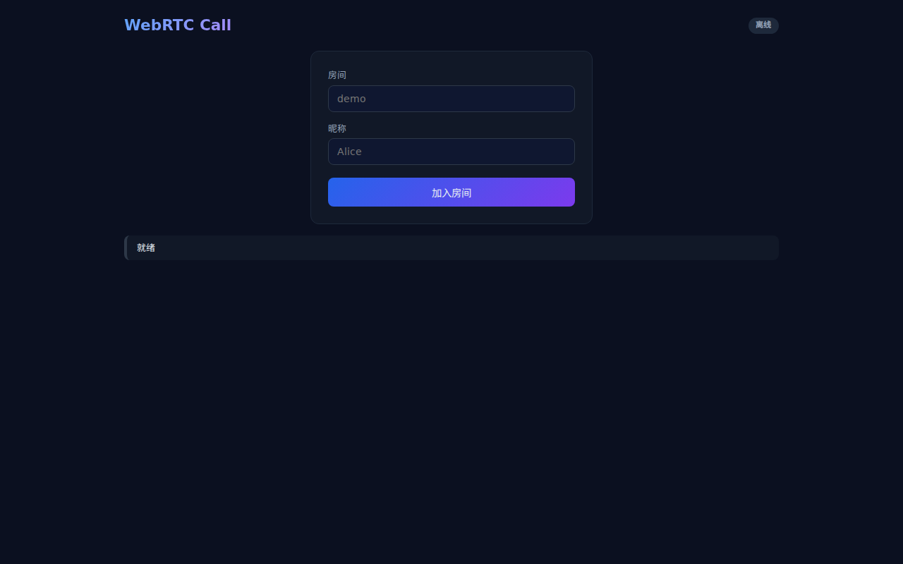
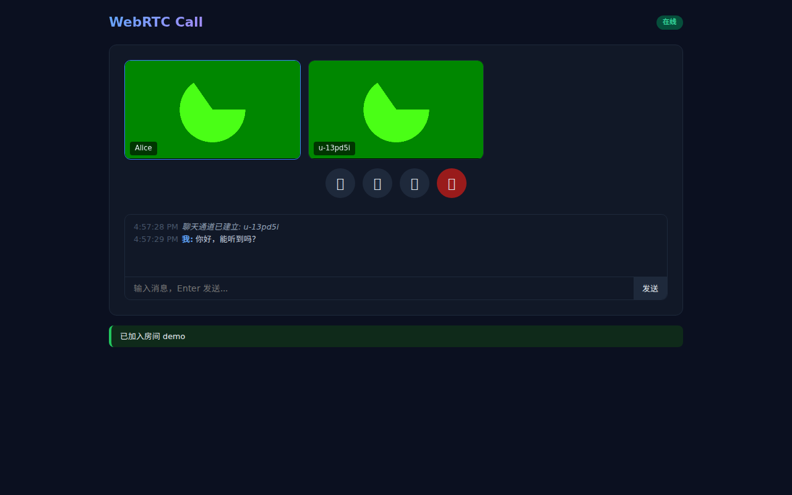
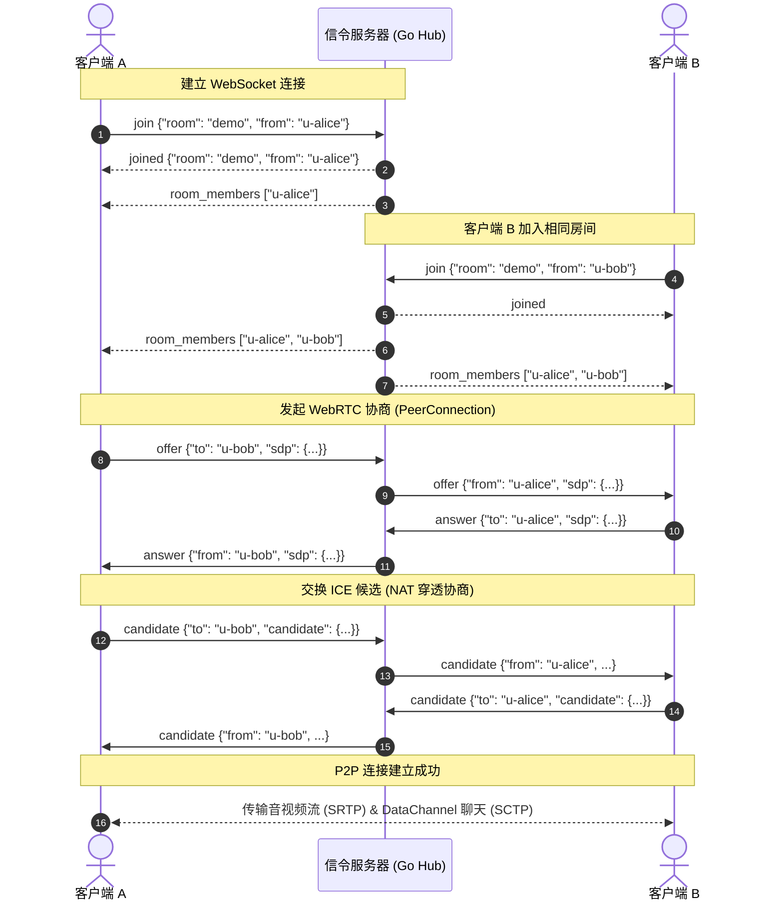

# WebRTC Call

<p align="center">
  
  
  
  
  
</p>

基于浏览器原生 WebRTC API（1v1 及小规模 Mesh 多人）实现的音视频通话与实时交互客户端，配套用 Go 实现的轻量级 WebSocket 信令服务。

本项目与后端工程化信令服务 **[webrtc-signaling](https://github.com/build-workbench/webrtc-signaling)** 互为姊妹项目，形成「**前端通话客户端 ↔ 后端分布式信令服务**」的对照。

---

## 目录

- [关于本项目](#关于本项目)
- [核心特性](#核心特性)
- [系统架构与时序](#系统架构与时序)
- [快速开始](#快速开始)
  - [本地运行](#本地运行)
  - [局域网 / 多设备测试注意点](#局域网--多设备测试注意点)
- [信令协议规范](#信令协议规范)
  - [消息格式定义](#消息格式定义)
  - [信令错误码](#信令错误码)
- [配置说明](#配置说明)
- [常用开发命令](#常用开发命令)
- [Docker 部署](#docker-部署)
- [项目结构](#项目结构)
- [常见问题与已知局限](#常见问题与已知局限)
- [许可证](#许可证)

---

## 截图

| 加入房间 | 1v1 通话 |
|----------|----------|
|  |  |

## 关于本项目

本项目旨在通过最精简、清晰的代码，完整跑通 WebRTC 音视频与数据通道通信的全流程：

- **前端**：采用纯原生 HTML5 / JavaScript 单文件开发，**无任何前端框架、无打包构建工具**，开箱即用。
- **后端**：使用 Go + `gorilla/websocket` 实现极简信令路由、房间生命周期管理与客户端流量控制。
- **定位**：学习、探索与实验性质的开源项目，代码力求结构清晰、开箱能跑。

> [!NOTE]
> 本项目采用全连接（Full Mesh）P2P 拓扑结构，媒体流不经过服务器转发，适合 1v1 或 2~4 人的轻量通话场景。如需生产级的大规模会议，建议了解 SFU（如 LiveKit、Mediasoup）架构。

---

## 核心特性

### 🌐 浏览器前端体验
- **零依赖单文件**：整个前端逻辑封装于 [`web/index.html`](web/index.html)，无 npm/vite 编译流程。
- **音视频通话**：支持 1v1 以及多人 Mesh 音视频互通，动态自适应多宫格视频布局。
- **外设控制**：支持一键静音/取消静音、关闭/开启摄像头画面。
- **屏幕共享**：基于 `getDisplayMedia` 接口实现桌面/窗口采集，无缝替换当前 PeerConnection 视频轨。
- **P2P 数据聊天**：基于 WebRTC `RTCDataChannel` 实现客户端之间直接收发消息，不占用信令服务器带宽。
- **连接韧性**：内置指数退避重连机制（最多重试 5 次）与心跳保活检测。

### ⚙️ Go 信令后端
- **房间管理**：基于内存的 `Hub` 管理客户端会话，自动回收空置房间。
- **精准消息路由**：支持基于 `To` 字段的点对点转发及房间广播。
- **防护与限流**：内置令牌桶速率限制（突发 50 条，稳态 30 条/秒），防止恶意刷包。
- **安全与运维**：
  - 支持 `Origin` 白名单过滤与 HTTP 安全响应头注入（`X-Content-Type-Options: nosniff`, `X-Frame-Options: DENY`）。
  - 健康检查探针接口（`GET /healthz`）。
  - 支持系统信号监听与平滑优雅下线（Graceful Shutdown）。

---

## 系统架构与时序

### 网络拓扑

```
┌──────────────┐                       ┌──────────────┐
│   Client A   │◄─────── WebSocket ───►│  Go Hub Svr  │
│ (web/browser)│     (信令交互/路由)    │  (:8080/ws)  │
└──────┬───────┘                       └──────┬───────┘
       │                                      │
       │                               WebSocket
       │                               (信令交互)
       │                                      │
       │                               ┌──────▼───────┐
       │                               │   Client B   │
       │                               │ (web/browser)│
       │                               └──────┬───────┘
       │                                      │
       └═══════════════ P2P 直连 ══════════════┘
            • 媒体流 (SRTP): 音频 / 视频 / 屏幕共享
            • 数据通道 (SCTP): RTCDataChannel 文本消息
```

### 通信时序图



---

## 快速开始

### 前置要求

- 安装 [Go](https://go.dev/dl/) (>= 1.22)

### 本地运行

1. **启动服务**：
   ```bash
   go run ./cmd/server
   ```
   或者通过 Makefile：
   ```bash
   make run
   ```

2. **体验通话**：
   - 打开浏览器访问 `http://localhost:8080`。
   - 输入房间名（如 `demo`）和昵称（如 `Alice`），允许浏览器调用摄像头与麦克风。
   - 另开一个标签页或隐身窗口，同样访问 `http://localhost:8080`，输入相同房间名及另一昵称（如 `Bob`）。
   - 双端即可建立 P2P 音视频通话并使用底部聊天框文字聊天。

### 局域网 / 多设备测试注意点

> [!WARNING]
> **关于浏览器摄像头/麦克风权限的限制**：
> 现代浏览器（Chrome、Edge、Safari 等）出于安全要求，**仅允许在安全上下文（Secure Context，即 `localhost` 或 `https://`）下调用 `getUserMedia` 音视频接口**。
>
> 如果要在局域网内通过 IP（如 `http://192.168.1.x:8080`）跨设备测试，有两种解决方式：
> 1. **Chrome 开发者免安全检测标志**：
>    在远端设备的 Chrome 地址栏输入 `chrome://flags/#unsafely-treat-insecure-origin-as-secure`，将你的服务地址（例如 `http://192.168.1.100:8080`）填入并启用（Enabled），重启浏览器即可授权媒体设备。
> 2. **配置反向代理（推荐）**：使用 Caddy、Nginx 或 mkcert 本地签发自签名证书，通过 HTTPS 访问。

---

## 信令协议规范

WebSocket 服务挂载于 `/ws`，消息均采用 JSON 格式，通过 `type` 字段区分消息动作。

### 1. 客户端发送 (Client → Server)

| type | 必要字段 | 示例与说明 |
|:-----|:--------|:----------|
| `join` | `room`, `from` | `{"type":"join","room":"demo","from":"user-1"}` 加入指定房间 |
| `leave` | - | `{"type":"leave"}` 主动离开房间并清理资源 |
| `ping` | - | `{"type":"ping"}` 客户端保活心跳 |
| `offer` | `to`, `sdp` | `{"type":"offer","to":"user-2","sdp":{...}}` 发送 SDP Offer |
| `answer` | `to`, `sdp` | `{"type":"answer","to":"user-1","sdp":{...}}` 发送 SDP Answer |
| `candidate` | `to`, `candidate` | `{"type":"candidate","to":"user-2","candidate":{...}}` 传输 ICE 候选 |
| `hangup` | `to` | `{"type":"hangup","to":"user-2"}` 结束与指定节点的通话（`to` 为空时广播） |

### 2. 服务端发送 (Server → Client)

| type | 包含字段 | 说明 |
|:-----|:--------|:-----|
| `joined` | `room`, `from` | 成功加入房间确认 |
| `room_members` | `room`, `members` | 房间内成员变动广播（全量成员 ID 数组） |
| `pong` | - | 心跳应答 |
| `error` | `code`, `error` | 信令错误通知 |

### 3. 信令协议错误码

| 错误码 (`code`) | 说明 |
|:--------------|:-----|
| `invalid_id` | 用户 ID 为空或包含非法字符（仅允许英文字母、数字、短横线、下划线，<= 64 字符） |
| `invalid_room` | 房间名称不合规或包含控制字符（<= 64 字符） |
| `duplicate_id` | 当前房间内已存在同名用户 ID |
| `identity_locked` | 单条 WebSocket 连接已绑定身份，不可中途变更 |
| `room_full` | 房间人数已达上限（默认单房间上限 50 人） |
| `room_limit_reached` | 全局房间数量达到上限（默认上限 1000 间） |
| `already_joined` | 客户端已在房间中，需先离开再加入其他房间 |
| `not_joined` | 尚未加入房间前尝试转发消息 |
| `invalid_target` / `target_not_found` | 目标对端 ID 无效，或目标用户已不在当前房间 |
| `rate_limited` | 触发单客户端发送速率限制（瞬时突发 > 50 或稳态 > 30 条/秒） |
| `unknown_type` | 不受支持的信令消息类型 |

---

## 配置说明

服务通过环境变量进行配置：

| 环境变量 | 默认值 | 说明 |
|:---------|:-------|:-----|
| `ADDR` | `:8080` | HTTP 与 WebSocket 监听地址及端口 |
| `WS_ALLOWED_ORIGINS` | *(空)* | WebSocket Origin 校验白名单。逗号分隔，如 `http://localhost:8080,https://mycall.com`；设为 `*` 时放行所有来源 |

---

## 常用开发命令

项目内置了标准 `Makefile` 方便日常构建与验证：

```bash
make run    # 启动本地服务
make test   # 运行单元测试（开启 -race 竞态检测）
make vet    # 执行 go vet 静态代码分析
make fmt    # 自动格式化 Go 代码
make build  # 编译二进制可执行文件
make clean  # 清理临时测试覆盖率文件
```

---

## Docker 部署

### 1. Docker Compose（推荐）

项目在 `deploy/docker/` 目录下提供了 Compose 配置：

```bash
docker compose -f deploy/docker/docker-compose.yml up -d --build
```

### 2. 手动构建镜像运行

```bash
# 构建镜像
docker build -f deploy/docker/Dockerfile -t webrtc-call .

# 启动容器并映射端口
docker run --rm -d -p 8080:8080 --name webrtc-call webrtc-call
```

---

## 项目结构

```
webrtc-call/
├── cmd/
│   └── server/
│       └── main.go           # 服务入口（HTTP 服务、路由初始化、优雅停机）
├── internal/
│   └── signal/               # 信令服务核心实现
│       ├── client.go         # 客户端连接抽象、写通道泵、令牌桶限流
│       ├── errors.go         # 协议级错误码与定义
│       ├── forward.go        # 点对点信令消息路由转发
│       ├── handler.go        # HTTP 升级 WebSocket 处理器
│       ├── hub.go            # 房间管理、全局会话调度与广播
│       ├── hub_test.go       # Hub 并发与核心逻辑测试
│       ├── join.go           # 用户进房逻辑与 ID/房间名规范化校验
│       ├── join_test.go      # 进房校验单元测试
│       └── message.go        # 信令消息结构体及类型常量
├── web/
│   └── index.html            # 原生单页面 Web 客户端（音视频 UI、WebRTC 逻辑、DataChannel）
├── deploy/
│   └── docker/
│       ├── Dockerfile        # 多阶段轻量 Alpine 镜像构建（含健康检查）
│       └── docker-compose.yml# 容器编排配置
├── Makefile                  # 构建、测试、格式化辅助脚本
├── CHANGELOG.md              # 版本变更记录
├── LICENSE                   # MIT 许可证
└── README.md
```

---

## 常见问题与已知局限

1. **为什么在非同一局域网下可能无法连通？**
   - 本项目默认配置公共 STUN 服务器（`stun:stun.l.google.com:19302`）用以获取外网映射地址。但在复杂的对等 NAT、对称 NAT（Symmetric NAT）或企业防火墙环境下，P2P 无法直接打洞，必须依赖 **TURN 中继服务器**。如需公网穿透，可在 [`web/index.html`](web/index.html) 的 `iceServers` 中配置自己的 coturn 等中继服务。
2. **Mesh 架构对房间人数有何限制？**
   - 在 Full Mesh 架构下，每个参与者都需要向其他 $N-1$ 个参与者分别编码推流和建立连接，全房间连接总数为 $\frac{N(N-1)}{2}$。客户端上传下行带宽和 CPU 开销随人数呈二次方增长，通常建议单房间 2~4 人。
3. **前端为什么不使用 Vue/React？**
   - 项目初衷是还原 WebRTC 原生 API（`RTCPeerConnection`、`RTCDataChannel`、`MediaStream`）的最本质用法，去除所有构建工具与框架抽象，让使用者能直接查阅和调试每一个原生事件。

---

## 许可证

本项目采用 [MIT 许可证](LICENSE) 开源。
